# Give another look at your resources

My Console uses the Cloud Foundry API to show a snapshot of your organizations, spaces, applications and services.

**My Console does not store any of your Cloud Foundry information. All data is stored locally in your web browser [local storage](https://en.wikipedia.org/wiki/Web_storage).**

## Usage

  * Go to [My Console](https://myconsole.mybluemix.net):

  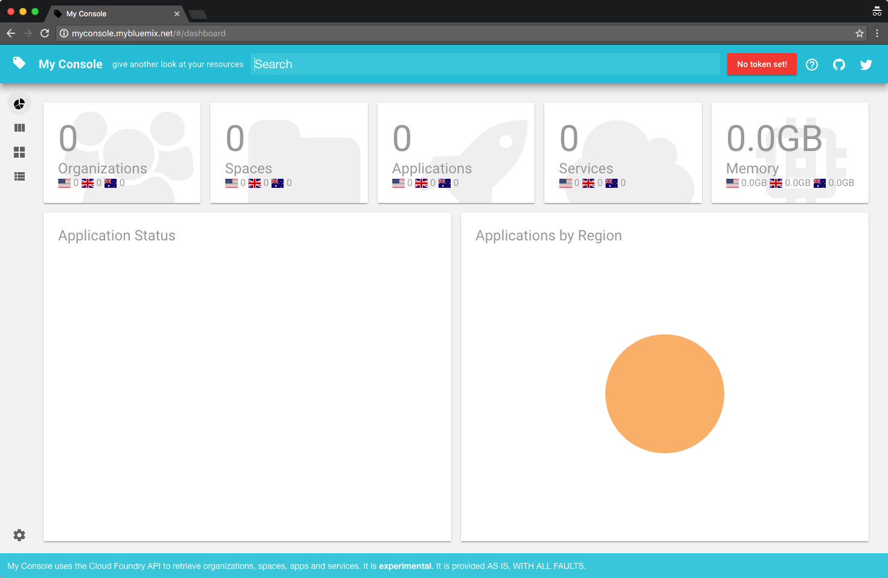

  * Go to [the settings](https://myconsole.mybluemix.net/#/settings):

  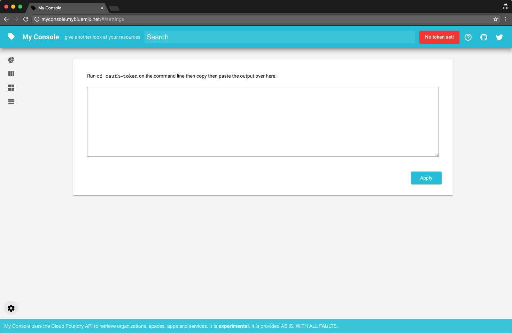

  * Open a terminal and retrieve an authentication token from Cloud Foundry:

  ```
  cf oauth-token
  ```

  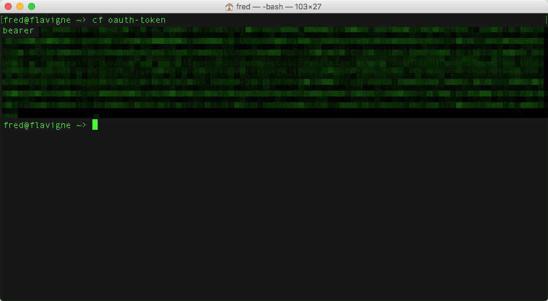

  * Copy and paste the result in the settings:

  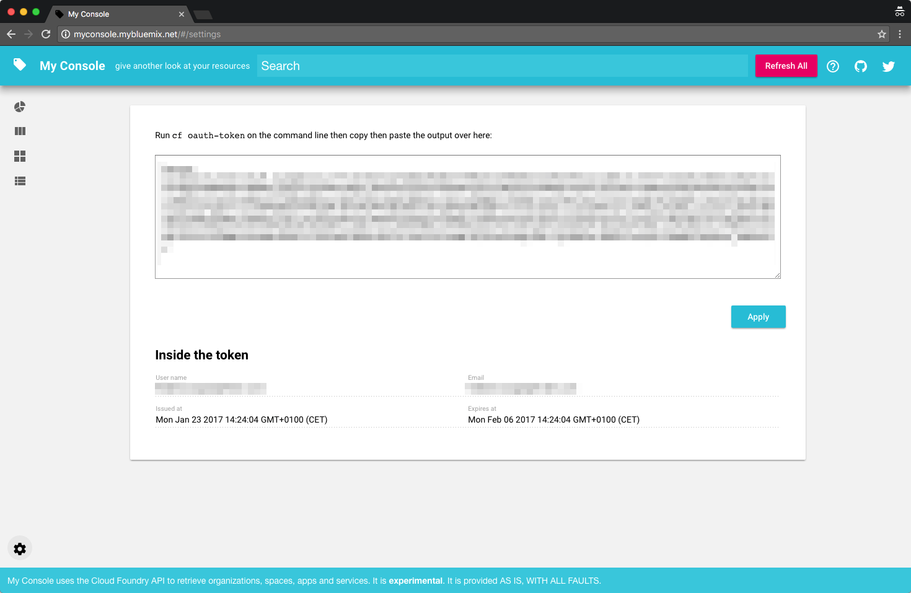

  > Make sure to copy the full output including the *bearer* keyword.

  * Switch to [the dashboard](https://myconsole.mybluemix.net/#/dashboard):

  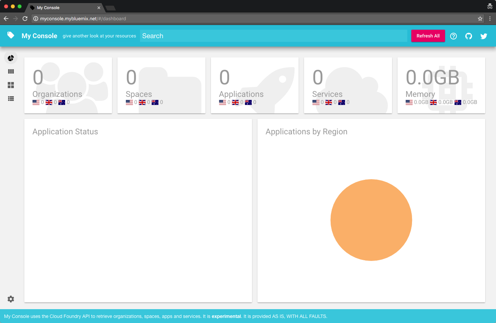

  * **Refresh All** data:

  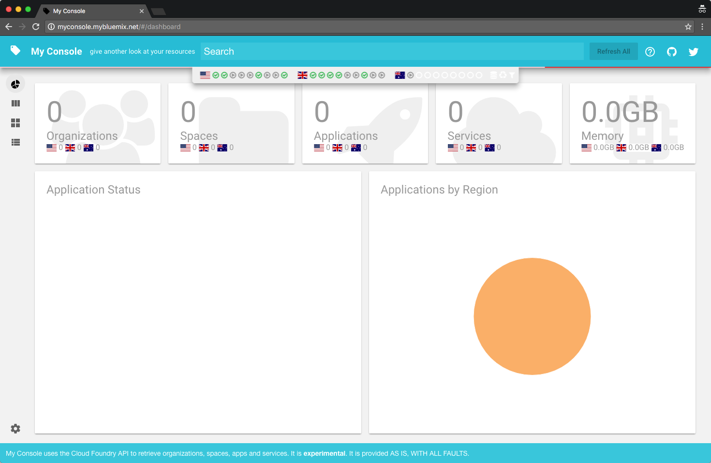

  * After a while global numbers are shown:

  

  * Use the [Navigator](https://myconsole.mybluemix.net/#/navigate) view to quickly navigate organizations, spaces, apps and services:

  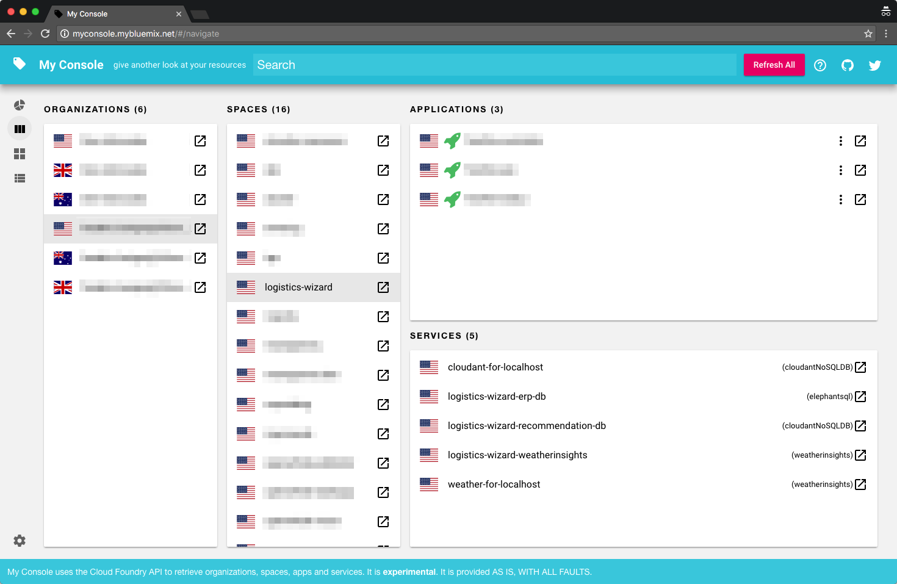

  * or the [Browser](https://myconsole.mybluemix.net/#/browse) view. Here showing all Object Storage services:

  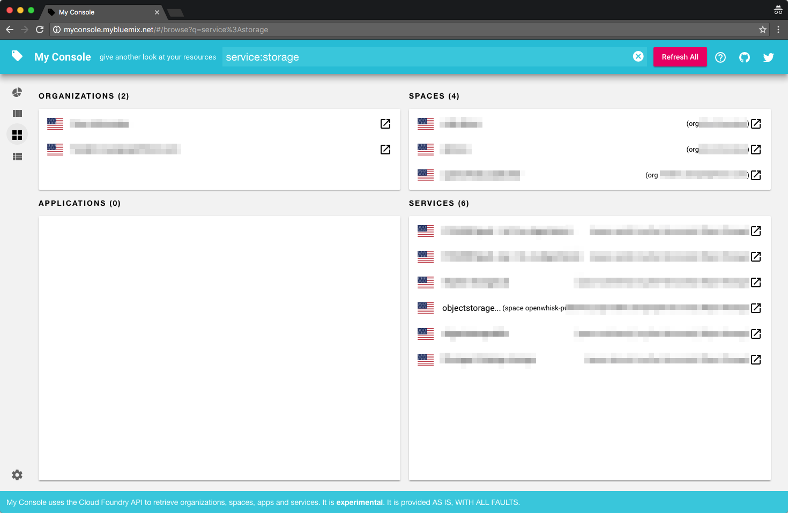

  * or the [List]() view. Here showing all apps marked as stopped or down:

  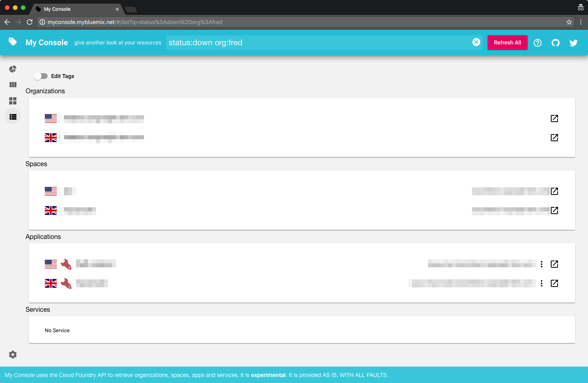

  * or use the Search bar to find an app by its routes:

  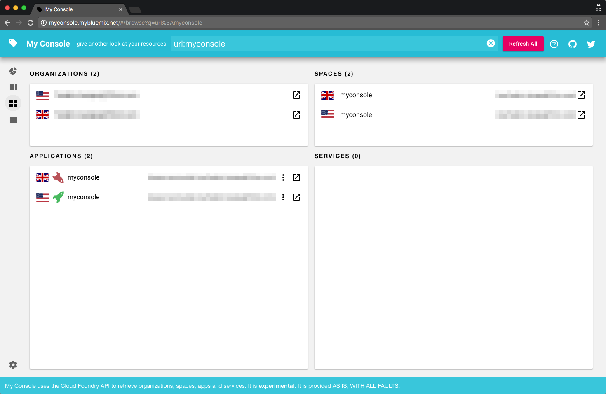

  * or limit to a given space to find how much your solution (many regions, apps and services) consume:

  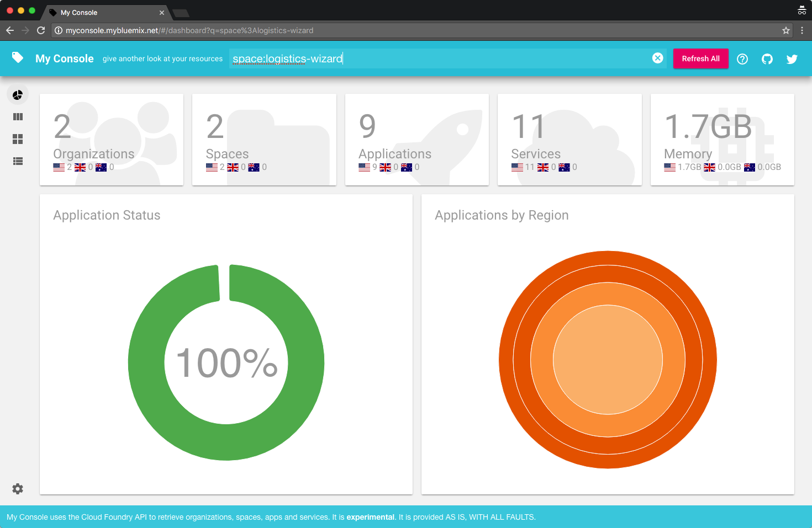

  * Check [the help](https://myconsole.mybluemix.net/#/help) for more additional details and tips on using the search bar.

## License

My Console is licensed under the Apache License Version 2.0 (http://www.apache.org/licenses/LICENSE-2.0).
